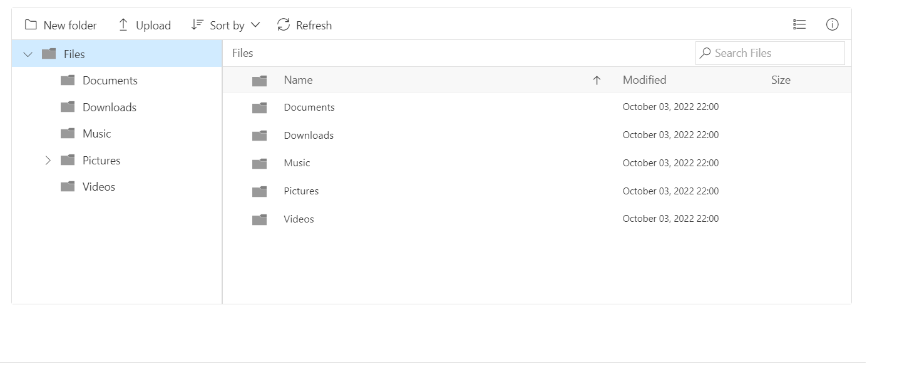

# 文件系统架构
该文件系统主要划分为两个部分: 界面与逻辑处理，即前端界面与后台服务。
界面显示方面，会适应两个构架的访问，即C/S、B/S架构。因此界面的设计就分成两个部分:
1. Browser界面设计
2. 桌面端界面设计  

浏览器界面设计可以使用React前端框架实现

桌面端界面出于对适配与轻量的考虑，因此采用wdWidgets库设计
后台服务需要提供的内容就相对比较多了
1. 文件I/O处理
2. 独立的FUSE文件系统
3. 消息统一处理机制设计
4. 网络通信协议设计
    * 网络库应用
    * 应用moduo库，C++11重制

## 前端界面
前端界面是一个十分重要的对外展示的窗口，规划的界面效果图如下所示:

包含的功能有:
1. 文件操作
    * 剪切
    * 拷贝
    * 删除
    * 下载
    * 重命名

2. 新建文件夹
3. 支持右键功能
4. 支持文件预览
5. 文件属性查看
6. 获取当前文件状态
7. 按标签对文件进行分类
8. 刷新获取当前文件状态
9. 管理文件系统的目录结构
    * 多选
    * 目录收放

## 后端业务
需要提供的功能有:
1. 日志系统
2. 通用网络库
    * 多线程处理用户请求
    * 网络协议设计，如Http、Ftp
3. 用户配置文件
4. FUSE用户文件系统
5. 统一消息处理机制  

详细设计文档在这里: [设计文档](./doc/Backstage_Logic.md)

